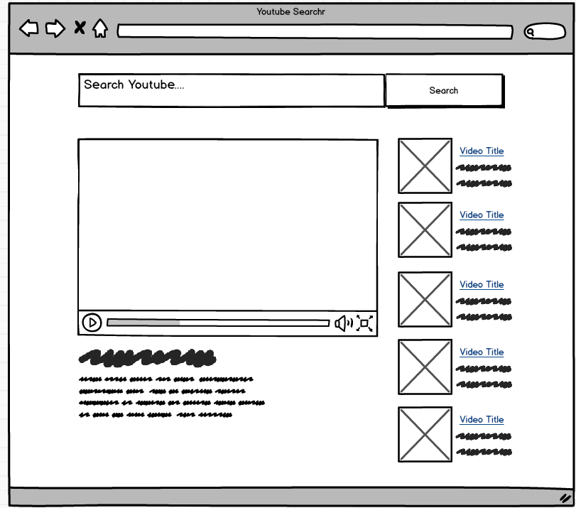

# Youtube Example App



## A few things of note

#### iframes are weird

iframes are a little bit picky about the url you use for the `src` attribute.
To get the video to render be sure to set up the embedUrl along the lines of:

```js
// videoId is coming from the api response,
// to be found at .id.videoId
const embedUrl = `https://www.youtube.com/embed/${videoId}`;

// in the JSX
<iframe src={embedUrl} />
```
#### Build out static app before adding api communication

There is an example API response in YoutubeContainer.js

Try to follow something along the lines of the steps described in *Fullstack React* for building any React application

1. Break the app into components
2. Build a static version of the app
3. Determine what should be stateful
4. Determine in which component each piece of state should live
5. Hard-code initial states
6. Add inverse data flow
7. Add server communication

i.e. add some static initial state and only add in fetch request after

#### api key

create a file in the `src` directory called `keys.js`.

The code inside mine is:

```js
export default {
  API_KEY: `<API Key here>`
};

```

components

App *needs state* & _make fetch_
 - Search
 - VideoContainer
   - VideoDisplay
   - VideoList
    - VideoItem

next steps:
  - make the search bar work
    - takes in a term, fetches a new list of videos related to that term

  - select a video from the sidebar and have it render as the detail

- LifeCycle Methods, especially componentDidMount
- finish controlling our input


